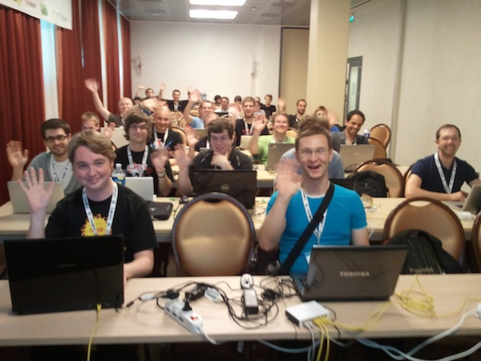
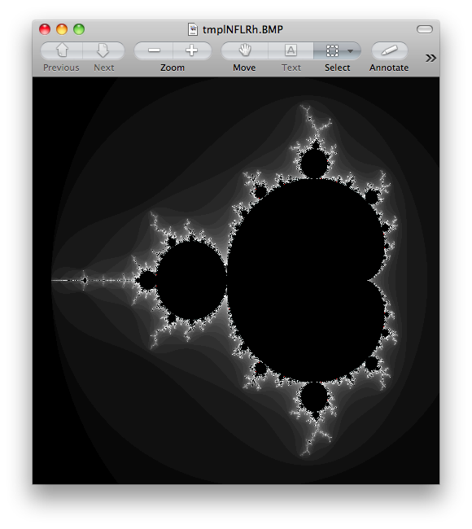
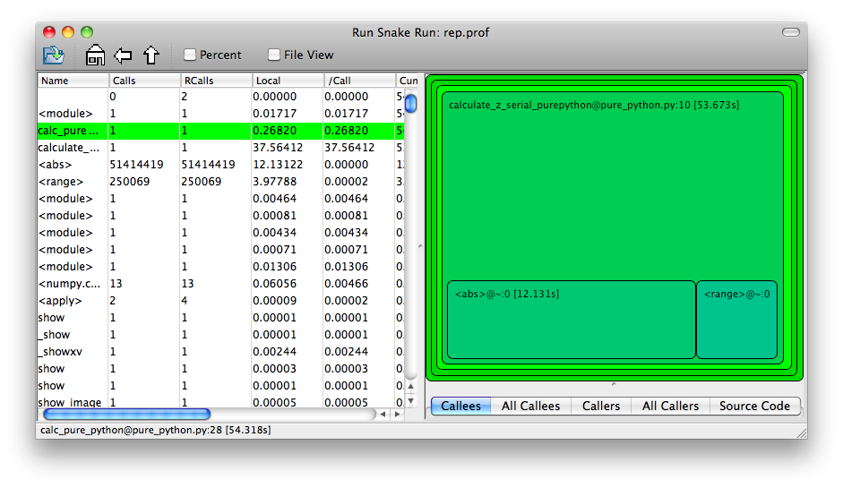

.. High Performance Python (from Training at EuroPython 2011) documentation master file, created by
   sphinx-quickstart on Thu Jun 23 12:10:20 2011.
   You can adapt this file completely to your liking, but it should at least
   contain the root `toctree` directive.

High Performance Python Tutorial (from EuroPython 2011 Training)
================================================================

Author: 

* Ian Ozsvald (ian@ianozsvald.com)

Version:

* 0.1_hastily_written_whilst_returing_from_EuroPython_20110626

Websites: 

* http://IanOzsvald.com (personal)
* http://twitter.com/ianozsvald
* http://MorConsulting.com (my A.I./H.P.C. consultancy)

Source:

* http://tinyurl.com/europyhpc # zip file of build-as-you-go training src (but may get out of date)
* https://github.com/ianozsvald/EuroPython2011_HighPerformanceComputing # full src for all examples (up to date)
* http://ep2011.europython.eu/conference/talks/experiences-making-cpu-bound-tasks-run-much-faster # slides

Questions?

* If you have Python questions then the Python Tutor list is an excellent resource
* If you have questions about a specific library (e.g. pyCUDA) then go to the right user group for the best help
* You can contact me if you have improvements or if you've spotted errors (but I can't help you learn Python, sorry!)

License: **Creative Commons By Attribution** (and if you find this useful and you meet me in reality, I will happily accept a beer :-))

Indices and tables
==================

* :ref:`genindex`
* :ref:`modindex`
* :ref:`search`

Testimonials from EuroPython 2011
=================================

* *@ianozsvald does an excellent workshop on what one needs to know about performance and python #europython* **@LBdN**
* *Ozsvald's training about speeding up tasks yesterday was awesome! #europython* **@Mirko_Rossini**
* *#EuroPython high performance #Python workshop by @ianozsvald is most excellent! Learned about RunSnakeRun, line profiler, dis module, Cython* **@mstepniowski**
* *@ianozsvald's talk on speeding up #python code is high speed itself! #europython* **@snakecharmerb**
* *Inspired to try out pp after @ianozsvald #EuroPython training* **@ajw007**
* *@mstepniowski @ianozsvald line profiler is amazing, and such a hidden gem* **@zeeg**
* *First half of the optimization training with @ianozsvald (http://t.co/zU16MXQ) has been fun and really interesting #europython* **@pagles**

    My happy class at EuroPython 2011

Motivation
==========

I ran a 4 hour tutorial on High Performance Python at EuroPython 2011. I'd like to see the training go to more people so I've written this guide. This is based on the official tutorial with some additions, I'm happy to accept updates.

The slides for tutorial are linked on the front page of this document.

Goal
====

In this tutorial we're looking at a number of techniques to make CPU-bound tasks in Python run much faster. Speed-ups of 10-500* are to be expected if you have a problem that fits into these solutions.

Techniques covered:

* Python profiling (cProfile, RunSnake, line_profiler) - find bottlenecks
* PyPy - Python's new Just In Time compiler
* Cython - annotate your code and compile to C
* numpy integration with Cython - fast numerical Python library wrapped by Cython
* ShedSkin - automatic code annotation and conversion to C
* numpy vectors - fast vector operations using numpy arrays
* NumExpr on numpy vectors - automatic numpy compilation to multiple CPUs and vector units
* multiprocessing - built-in module to use multiple CPUs
* ParallelPython - run tasks on multiple computers
* pyCUDA - run tasks on your Graphics Processing Unit

**NOTEIAN graph the speed-ups we see, show cpython, C, parallel, pycuda**

Using this as a tutorial
========================

If you grab the source from https://github.com/ianozsvald/EuroPython2011_HighPerformanceComputing (or Google for "ianozsvald github") you can follow along. The github repository has the full source for all these examples (and a few others), you can start with the ``pure_python.py`` example and make code changes yourself.

You probably want to use ``numpy_loop.py`` and ``numpy_vector.py`` for the basis of some of the ``numpy`` transformations.

The Mandelbrot problem
======================

In this tutorial we'll be generating a Mandelbrot plot, we're coding mostly in pure Python. If you want a background on the Mandelbrot set then take a look at WikiPedia. This is the output we're after:

  A 500 by 500 pixel Mandelbrot with maximum 1000 iterations

We're using the Mandelbrot problem as we can vary the complexity of the task by drawing more (or less) pixels and we can calculate more (or less) iterations per pixel. We'll look at improvements in Python to make the code run a bit faster and then we'll look at fast C libraries and ways to convert the code directly to C for the best speed-ups.

This task is embarressignly parallel which means that we can easily parallelise each operation. This allows us to experiment with multi-CPU and multi-machine approaches along with trying NVIDIA's CUDA on a Graphics Processing Unit.

Versions and dependencies
=========================

The tools depend on a few other libraries, you'll want to install them first:

* CPython 2.7.2
* PyPy 1.5
* Numpy 1.5.1
* Cython 0.14.1
* ShedSkin 0.8 (and this depends on a few C libraries)
* NumExpr 1.4.2
* RunSnake 2.0.1 (and it depends on wxPython)
* line_profiler 1.0b2
* pyCUDA 0.94 (HEAD as of June 2011 and it depends on the CUDA development libraries, I'm using CUDA 4.0)
* PIL (for drawing the plot)

Pure Python (CPython) implementation
====================================

Below we have the basic pure-python implementation. Typically you'll be using CPython to run the code (CPython being the Python language running in a C-language interpreter). This is the most common way to run Python code (on Windows you use ``python.exe``, on Linux and Mac it is often just ``python``).

In each example we have a ``calculate_z`` function (here it is ``calculate_z_serial_purepython``), this does the hard work calculating the output vector which we'll display. This is called by a ``calc`` function (in this case it is ``calc_pure_python``) which sets up the input and displays the output.

In ``calc`` I use a simple routine to prepare the ``x`` and ``y`` co-ordinates which is compatible between all the techniques we're using. These co-ordinates are appended to the array ``q`` as ``complex`` numbers. We also initialise ``z`` as an array of the same length using ``complex(0,0)``. The motivation here is to setup some input data that is non-trivial which might match your own input in a real-world problem.

For my examples I used a 500 by 500 pixel plot with 1000 maximum iterations. Setting ``w`` and ``h`` to ``1000`` and using the default ``x1, x2, y1, y2`` space we have a 500 by 500 pixel space that needs to be calculated. This means that ``z`` and ``q`` are ``250,000`` elements in length. Using a ``complex`` datatype (16 bytes) we have a total of 16 bytes * 250,000 items * 2 arrays == 8,000,000 bytes (i.e. roughly 8MB of input data).

In the pure Python implementation on a core 2 duo MacBook using CPython 2.7.2 it takes roughly 52 seconds to solve this task. We run it using ``>> python pure_python.py 1000 1000``. If you have ``PIL`` and ``numpy`` installed then you'll get the graphical plot. 

**NOTE** that the first argument is ``1000`` and this results in a 500 by 500 pixel plot. This is confusing (and is based on inherited code that I should have fixed...) - I'll fix the ``*2`` oddness in a future version of this document. For now I'm more interested in writing this up before I'm back from EuroPython! 

::

    # \python\pure_python.py
    import sys
    import datetime
    # area of space to investigate
    x1, x2, y1, y2 = -2.13, 0.77, -1.3, 1.3

    # Original code, prints progress (because it is slow)
    # Uses complex datatype

    def calculate_z_serial_purepython(q, maxiter, z):
        """Pure python with complex datatype, iterating over list of q and z"""
        output = [0] * len(q)
        for i in range(len(q)):
            if i % 1000 == 0:
                # print out some progress info since it is so slow...
                print "%0.2f%% complete" % (1.0/len(q) * i * 100)
            for iteration in range(maxiter):
                z[i] = z[i]*z[i] + q[i]
                if abs(z[i]) > 2.0:
                    output[i] = iteration
                    break
        return output

    def calc_pure_python(show_output):
        # make a list of x and y values which will represent q
        # xx and yy are the co-ordinates, for the default configuration they'll look like:
        # if we have a 500x500 plot
        # xx = [-2.13, -2.1242, -2.1184000000000003, ..., 0.7526000000000064, 0.7584000000000064, 0.7642000000000064]
        # yy = [1.3, 1.2948, 1.2895999999999999, ..., -1.2844000000000058, -1.2896000000000059, -1.294800000000006]
        x_step = (float(x2 - x1) / float(w)) * 2
        y_step = (float(y1 - y2) / float(h)) * 2
        x=[]
        y=[]
        ycoord = y2
        while ycoord > y1:
            y.append(ycoord)
            ycoord += y_step
        xcoord = x1
        while xcoord < x2:
            x.append(xcoord)
            xcoord += x_step
        q = []
        for ycoord in y:
            for xcoord in x:
                q.append(complex(xcoord,ycoord))

        z = [0+0j] * len(q)
        print "Total elements:", len(z)
        start_time = datetime.datetime.now()
        output = calculate_z_serial_purepython(q, maxiter, z)
        end_time = datetime.datetime.now()
        secs = end_time - start_time
        print "Main took", secs

        validation_sum = sum(output)
        print "Total sum of elements (for validation):", validation_sum

        if show_output: 
            try:
                import Image
                import numpy as nm
                output = nm.array(output)
                output = (output + (256*output) + (256**2)*output) * 8
                im = Image.new("RGB", (w/2, h/2))
                im.fromstring(output.tostring(), "raw", "RGBX", 0, -1)
                im.show()
            except ImportError as err:
                # Bail gracefully if we're using PyPy
                print "Couldn't import Image or numpy:", str(err)

    if __name__ == "__main__":
        # get width, height and max iterations from cmd line
        # 'python mandelbrot_pypy.py 100 300'
        w = int(sys.argv[1]) # e.g. 100
        h = int(sys.argv[1]) # e.g. 100
        maxiter = int(sys.argv[2]) # e.g. 300
        
        # we can show_output for Python, not for PyPy
        calc_pure_python(True)

When you run it you'll also see a ``validation sum`` - this is the summation of all the values in the ``output`` list, if this is the same between executions then your program's math is progressing in exactly the same way (if it is different then something different is happening!). This is very useful when you're changing one form of the code into another - it should always produce the same validation sum.
        

Profiling with cProfile and line_profiler
=========================================

The ``profile`` module is the standard way to profile Python code, take a look at it here ``http://docs.python.org/library/profile.html``. We'll run it on our simple Python implementation:

::

    >> python -m cProfile -o rep.prof pure_python.py 1000 1000

This generates a ``rep.prof`` output file containing the profiling results, we can now load this into the ``pstats`` module and print out the top 10 slowest functions:

::

    >>> import pstats
    >>> p = pstats.Stats('rep.prof')
    >>> p.sort_stats('cumulative').print_stats(10)

    Fri Jun 24 17:13:11 2011    rep.prof

             51923594 function calls (51923523 primitive calls) in 54.333 seconds

       Ordered by: cumulative time
       List reduced from 558 to 10 due to restriction <10>

       ncalls  tottime  percall  cumtime  percall filename:lineno(function)
            1    0.017    0.017   54.335   54.335 pure_python.py:1(<module>)
            1    0.268    0.268   54.318   54.318 pure_python.py:28(calc_pure_python)
            1   37.564   37.564   53.673   53.673 pure_python.py:10(calculate_z_serial_purepython)
     51414419   12.131    0.000   12.131    0.000 {abs}
       250069    3.978    0.000    3.978    0.000 {range}
            1    0.005    0.005    0.172    0.172 .../numpy/__init__.py:106(<module>)
            1    0.001    0.001    0.129    0.129 .../numpy/add_newdocs.py:9(<module>)
            1    0.004    0.004    0.116    0.116 .../numpy/lib/__init__.py:1(<module>)
            1    0.001    0.001    0.071    0.071 .../numpy/lib/type_check.py:3(<module>)
            1    0.013    0.013    0.070    0.070 .../numpy/core/__init__.py:2(<module>)

Take a look at the ``profile`` module's Python page for details. Basically the above tells us that ``calculate_z_serial_purepython`` is run once, costs 37 seconds for its own lines of code and in total (including the other functions it calls) costs a total of 53 seconds. This is obviously our bottleneck. 

We can also see that ``abs`` is called 51,414,419 times, each call costs a tiny fraction of a second but 54 million add up to 12 seconds.

The final lines of the profile relate to ``numpy`` - this is the numerical library I've used to convert the Python lists into a PIL-compatible RGB string for visualisation (so you need ``PIL`` and ``numpy`` installed).

For more complex programs the output becomes hard to understand. ``runsnake`` is a great tool to visualise the profiled results:

  RunSnakeRun's output on pure_python.py

Now we can visually see where the time is spent. I use this to identify which functions are worth dealing with first of all - this tool really comes into its own when you have a complex project with many modules.

*However* - which *lines* are causing our code to run slow? This is the more interesting question and ``cProfile`` can't answer it.

Let's look at the ``line_profer`` module. First we have to decorate our chosen function with ``@profile``:

::

    @profile
    def calculate_z_serial_purepython(q, maxiter, z):

Next we'll run ``kernprof.py`` and ask it to do line-by-line profiling and to give us a visual output, then we tell it what to profile. **Note** that we're running a much smaller problem as line-by-line profiling takes ages:

::

    >> kernprof.py -l -v pure_python.py 300 100

    File: pure_python.py
    Function: calculate_z_serial_purepython at line 9
    Total time: 354.689 s

    Line #      Hits         Time  Per Hit   % Time  Line Contents
    ==============================================================
         9                                           @profile
        10                                           def calculate_z_serial_purepython(q, maxiter, z):
        11                                               """Pure python with complex datatype, iterating over list of q and z"""
        12         1         2148   2148.0      0.0      output = [0] * len(q)
        13    250001       534376      2.1      0.2      for i in range(len(q)):
        14    250000       550484      2.2      0.2          if i % 1000 == 0:
        15                                                       # print out some progress info since it is so slow...
        16       250        27437    109.7      0.0              print "%0.2f%% complete" % (1.0/len(q) * i * 100)
        17  51464485    101906246      2.0     28.7          for iteration in range(maxiter):
        18  51414419    131859660      2.6     37.2              z[i] = z[i]*z[i] + q[i]
        19  51414419    116852418      2.3     32.9              if abs(z[i]) > 2.0:
        20    199934       429692      2.1      0.1                  output[i] = iteration
        21    199934      2526311     12.6      0.7                  break
        22         1            9      9.0      0.0      return output
   
Here we can see that the bulk of the time is spent in the ``for iteration in range(maxiter):`` loop. If the ``z[i] = z[i] * z[i] + q[i]`` and ``if abs(z[i]) > 2.0:`` lines ran faster then the entire function would run much faster.

This is the easiest way to identify which lines are causing you the biggest problems. Now you can focus on fixing the bottleneck rather than guessing at which lines might be slow!

**REMEMBER** to remove the ``@profile`` decorator when you're done with ``kernprof.py`` else Python will throw an exception (it won't recognise ``@profile`` outside of ``kernprof.py``).

Bytecode analysis
=================

There are several keys ways that you can make your code run faster. Having an understanding of what's happening in the background can be useful. Python's ``dis`` module lets us disassemble the code to see the underlying bytecode.

We can use ``dis.dis(fn)`` to disassemble the bytecode which represents ``fn``. First we'll ``import pure_python`` to bring our module into the namespace:

::

    >>> import pure_python # imports our solver into Python
    >>> dis.dis(pure_python.calculate_z_serial_purepython)
    ....
     18         109 LOAD_FAST                2 (z)   # load z
                112 LOAD_FAST                4 (i)   # load i
                115 BINARY_SUBSCR                    # get value in z[i]
                116 LOAD_FAST                2 (z)   # load z
                119 LOAD_FAST                4 (i)   # load i
                122 BINARY_SUBSCR                    # get value in z[i]
                123 BINARY_MULTIPLY                  # z[i] * z[i] 
                124 LOAD_FAST                0 (q)   # load z
                127 LOAD_FAST                4 (i)   # load i
                130 BINARY_SUBSCR                    # get q[i]
                131 BINARY_ADD                       # add q[i] to last multiply
                132 LOAD_FAST                2 (z)   # load z
                135 LOAD_FAST                4 (i)   # load i
                138 STORE_SUBSCR                     # store result in z[i]

     19         139 LOAD_GLOBAL              2 (abs) # load abs function
                142 LOAD_FAST                2 (z)   # load z
                145 LOAD_FAST                4 (i)   # load i
                148 BINARY_SUBSCR                    # get z[i]
                149 CALL_FUNCTION            1       # call abs
                152 LOAD_CONST               6 (2.0) # load 2.0
                155 COMPARE_OP               4 (>)   # compare result of abs with 2.0
                158 POP_JUMP_IF_FALSE      103       # jump depending on result

Above we're looking at lines 18 and 19. The right column shows the operations with my annotations. You can see that we load ``z`` and ``i`` onto the stack a lot of times. 

Pragmatically you won't optimise your code by using the ``dis`` module but it does help to have an understanding of what's going on under the bonnet.

A (slightly) faster CPython implementation
==========================================

Having taken a look at bytecode, let's make a small modification to the code. This modification is only necessary for CPython and PyPy - the C compiler options for us won't need the modification.

All we'll do is dereference the ``z[i]`` and ``q[i]`` calls once, rather than many times in the inner loops:

::

    # \python\pure_python_2.py
    for i in range(len(q)):
        zi = z[i]
        qi = q[i]
        ...
        for iteration in range(maxiter):
            zi = zi * zi + qi
            if abs(zi) > 2.0:
        
Now look at the ``kernprof.py`` output on our modified ``pure_python_2.py``. We have the same number of function calls but they're quicker - the big change being the cost of 2.6 seconds dropping to 2.2 seconds for the ``z = z * z + q`` line. If you're curious about how the change is reflected in the underlying bytecode then I urge that you try the ``dis`` module on your modified code.

::

    File: pure_python_2.py
    Function: calculate_z_serial_purepython at line 10
    Total time: 327.168 s

    Line #      Hits         Time  Per Hit   % Time  Line Contents
    ==============================================================
        10                                           @profile
        11                                           def calculate_z_serial_purepython(q, maxiter, z):
        12                                               """Pure python with complex datatype, iterating over list of q and z"""
        13         1         2041   2041.0      0.0      output = [0] * len(q)
        14    250001       519749      2.1      0.2      for i in range(len(q)):
        15    250000       508612      2.0      0.2          zi = z[i]
        16    250000       511306      2.0      0.2          qi = q[i]
        17    250000       535007      2.1      0.2          if i % 1000 == 0:
        18                                                       # print out some progress info since it is so slow...
        19       250        26760    107.0      0.0              print "%0.2f%% complete" % (1.0/len(q) * i * 100)
        20  51464485    100041485      1.9     30.6          for iteration in range(maxiter):
        21  51414419    112112069      2.2     34.3              zi = zi * zi + qi
        22  51414419    109947201      2.1     33.6              if abs(zi) > 2.0:
        23    199934       419932      2.1      0.1                  output[i] = iteration
        24    199934      2543678     12.7      0.8                  break
        25         1            9      9.0      0.0      return output

Here's the improved bytecode:

::

    >>> dis.dis(calculate_z_serial_purepython)
    ...
     22         129 LOAD_FAST                5 (zi)
                132 LOAD_FAST                5 (zi)
                135 BINARY_MULTIPLY     
                136 LOAD_FAST                6 (qi)
                139 BINARY_ADD          
                140 STORE_FAST               5 (zi)

     24         143 LOAD_GLOBAL              2 (abs)
                146 LOAD_FAST                5 (zi)
                149 CALL_FUNCTION            1
                152 LOAD_CONST               6 (2.0)
                155 COMPARE_OP               4 (>)
                158 POP_JUMP_IF_FALSE      123

You can see that we don't have to keep loading ``z`` and ``i``, so we execute fewer instructions (so things run faster).

PyPy
====

PyPy is a new just in time compiler for the Python programming language. It runs on Windows, Mac and Linux and as of the middle of 2011 it runs Python 2.7. Generally you code will just run in PyPy and often it'll run faster (I've seen reports of 2-10* speed-ups). Sometimes small amounts of work are required to correct code that runs in CPython but shows errors in PyPy. Generally this is because the programmer has (probably unwittingly!) used shortcuts that work in CPython that aren't actually correct in the Python specification.

Our example runs without modification in PyPy. I've used both PyPy 1.5 and the latest HEAD from the nightly builds (taken on June 20th for my Mac). The latest nightly build is a bit faster than PyPy 1.5.

If you *aren't* using a C library like ``numpy`` then you should try PyPy - it might just make your code run several times faster. At EuroPython 2011 I saw a Sobel Edge Detection demo than runs in pure Python - with PyPy it runs 450* faster than CPython! The PyPy team are committed to making PyPy faster and more stable, since it supports Python 2.7 (which is the end of the Python 2.x line) you can expect it to keep getting faster for a while yet.

If you use a C extension like ``numpy`` then expect problems - some C libraries are integrated, many aren't, some like ``numpy`` will probably require a re-write (which will be a multi-month undertaking). During 2011 at least it looks as though ``numpy`` integration will not happen.

By running ``pypy pure_python.py 1000 1000`` on my MacBook it takes 5.9 seconds, running ``pypy pure_python_2.py 1000 1000`` it takes 4.9 seconds. Note that there's no graphical output - ``PIL`` is supported in PyPy but ``numpy`` isn't and I've used ``numpy`` to generate the list-to-RGB-array conversion.

**NOTEIAN WHAT SPEEDUPS DO WE EXPECT?** 

Cython
======

Cython lets us annotate our functions so they can be compiled to C. It takes a little bit of work (30-60 minutes to get started) and then typically gives us a nice speed-up.

**NOTEIAN link to cython tutorial!**

To start this example I'll assume you've moved ``pure_python_2.py`` into a new directory (e.g. ``cython_pure_python\cython_pure_python.py``). We'll start a new module called ``calculate_z.py``, move the ``calculate_z`` function into this module. In ``cython_pure_python.py`` you'll have to ``import calculate_z`` and replace the reference to ``calculate_z(...)`` with ``calculate_z.calculate_z(...)``.

Verify that the above runs. The contents of your ``calculate_z.py`` will look like:

::

    # calculate_z.py
    # based on calculate_z_serial_purepython
    def calculate_z(q, maxiter, z):
        output = [0] * len(q)
        for i in range(len(q)):
            zi = z[i]
            qi = q[i]
            for iteration in range(maxiter):
                zi = zi * zi + qi
                if abs(zi) > 2.0:
                    output[i] = iteration
                    break
        return output

Now rename ``calculate_z.py`` to ``calculate_z.pyx``, Cython uses ``.pyx`` (based on the older Pyrex project) to indicate a file that it'll compile to C.

Now add a new ``setup.py`` with the following contents:

::

    # setup.py
    from distutils.core import setup
    from distutils.extension import Extension
    from Cython.Distutils import build_ext

    # for notes on compiler flags e.g. using
    # export CFLAGS=-O2
    # so gcc has -O2 passed (even though it doesn't make the code faster!)
    # http://docs.python.org/install/index.html

    setup(
            cmdclass = {'build_ext': build_ext},
            ext_modules = [Extension("calculate_z", ["calculate_z.pyx"])]
            )

Next run:

::

    python setup.py build_ext --inplace

This runs our ``setup.py`` script, calling the ``build_ext`` command. Our new module is built in-place in our directory, you should end up with a new ``calculate_z.so`` in this directory.

Run the new code using ``python cython_pure_python.py 1000 1000`` and confirm that the result is calculated more quickly (you may find that the improvement is very minor at this point!).

You can take a look to see how well the slower Python calls are being replaced with faster Cython calls using:

::

  cython -a calculate_z.pyx

This will generate a new ``.html`` file, open that in your browser and you'll see something like:

**NOTEIAN screen shot**

Each time you add a type annotation Cython has the option to improve the resulting code. When it does so successfully you'll see the dark yellow lines turn lighter and eventually they'll turn white (showing that no further improvement is possible).

Let's add the annotations, see the example below where I've added type definitions. Remember to run the ``cython -a ...`` command and monitor the reduction in yellow in your web browser.

::

    # based on calculate_z_serial_purepython
    def calculate_z(list q, int maxiter, list z):
        cdef unsigned int i
        cdef int iteration
        cdef complex zi, qi # if you get errors here try 'cdef complex double zi, qi'
        cdef list output

        output = [0] * len(q)
        for i in range(len(q)):
            zi = z[i]
            qi = q[i]
            for iteration in range(maxiter):
                zi = zi * zi + qi
                if abs(zi) > 2.0:
                    output[i] = iteration
                    break
        return output

Recompile using the ``setup.py`` line above and confirm that the result is much faster!

As you'll see in the ShedSkin version below we can achieve the best speed-up by expanding the complicated ``complex`` object into simpler ``double`` precision floating point numbers. The underlying C compiler knows how to execute these instructions in a faster way. 

Expanding ``complex`` multiplication and addition involves a little bit of algebra (see WikiPedia for details). We declare a set of intermediate variables ``cdef double zx, zy, qx, qy, zx_new, zy_new``, dereference them from ``z[i]`` and ``q[i]`` and then replaced the final ``abs`` call with the expanded ``if (zx*zx + zy*zy) > 4.0`` logic (the sqrt of 4 is 2.0, ``abs`` would otherwise perform an expensive square-root on the result of the addition of the squares).
**NOTEIAN final better math SPEEDUP**

::

    ian-ozsvalds-macbook:cython_pure_python ian$ more calculate_z.pyx_2_bettermath 
    def calculate_z(list q, int maxiter, list z):
        cdef unsigned int i
        cdef int iteration
        cdef list output
        cdef double zx, zy, qx, qy, zx_new, zy_new

        output = [0] * len(q)
        for i in range(len(q)):
            zx = z[i].real # need to extract items using dot notation
            zy = z[i].imag
            qx = q[i].real
            qy = q[i].imag

            for iteration in range(maxiter):
                zx_new = (zx * zx - zy * zy) + qx
                zy_new = (zx * zy + zy * zx) + qy
                # must assign after else we're using the new zx/zy in the fla
                zx = zx_new
                zy = zy_new
                # note - math.sqrt makes this almost twice as slow!
                #if math.sqrt(zx*zx + zy*zy) > 2.0:
                if (zx*zx + zy*zy) > 4.0:
                    output[i] = iteration
                    break
        return output

Cython with numpy arrays
========================

**NOTEIAN link to numpy tutorial, show final result**

ShedSkin
========

**NOTEIAN add comments about profiling from Mark**

ShedSkin automatically annotates your Python module and compiles it down to C. It works in a more restricted set of circumstances than Cython but when it works - it Just Works and requires very little effort on your part.

Its main limitations are:
* prefers short modules (less than 3,000 lines of code)
* only uses built-in modules (e.g. you can't import ``numpy`` or ``PIL`` into a ShedSkin module)

You run it using ``shedskin your_module.py``. In our case move ``pure_python_2.py`` into a new directory (``shedskin_pure_python\shedskin_pure_python.py``). We could make a new module (as we did for the Cython example) but for now we'll just one the one Python file.

Run:

::

    shedskin shedskin_pure_python.py
    make

After this you'll have ``shedskin_pure_python`` which is an executable. Try it and see what sort of speed-up you get.

ShedSkin has local C implementations of all of the core Python library (it can only ``import`` C-implemented modules that someone has written for ShedSkin!). For this reason we can't use ``numpy`` in a ShedSkin executable or module, you can pass a Python ``list`` across (and ``numpy`` lets you make a Python ``list`` from an ``array`` type), but that comes with a speed hit.

The ``complex`` datatype has been implemented in a way that isn't as efficient as it could be (ShedSkin's author - **Mark Darfur SPELLING?** has stated that it could be made much more efficient if there's demand). If we expand the math using some algebra in exactly the same way that we did for the Cython example we get another huge jump in performance:

::

    def calculate_z_serial_purepython(q, maxiter, z):
        output = [0] * len(q)
        for i in range(len(q)):
            zx, zy = z[i].real, z[i].imag
            qx, qy = q[i].real, q[i].imag
            for iteration in range(maxiter):
                # expand complex numbers to floats, do raw float arithmetic
                # as the shedskin variant isn't so fast
                # I believe MD said that complex numbers are allocated on the heap
                # and this could easily be improved for the next shedskin
                zx_new = (zx * zx - zy * zy) + qx
                zy_new = (2 * (zx * zy)) + qy # note that zx(old) is used so we make zx_new on previous line
                zx = zx_new
                zy = zy_new
                # remove need for abs and just square the numbers
                if zx*zx + zy*zy > 4.0:
                    output[i] = iteration
                    break
        return output

**optimisations? -ffast-math?  loop unrolling? auto vectorisation?**

numpy vectors
=============

Take a fresh copy of ``pure_python_2.py`` and copy it into ``numpy_vector/numpy_vector.py``. Import the ``numpy`` library and change the ``calculate_z`` routine to look like the one below. Run it and test that you get the same output as before.

::

    # ./numpy_vector/numpy_vector.py
    import numpy as np # 'np.' is a shorthand convention so you avoid writing 'numpy.' all the time

    def calculate_z_numpy(q, maxiter, z):
        """use vector operations to update all zs and qs to create new output array"""
        output = np.resize(np.array(0,), q.shape)
        for iteration in range(maxiter):
            z = z*z + q
            done = np.greater(abs(z), 2.0) # could have written it equivalently as 'done = abs(z) > 2.0'
            q = np.where(done, 0+0j, q)
            z = np.where(done, 0+0j, z)
            output = np.where(done, iteration, output)
        return output

``numpy``'s strength is that it simplifies running the same operation on a vector (or matrix) of numbers rather than on individual items in a ``list`` one at a time. 

If your problem normally involves using nested ``for`` loops to iterate over individual items in a ``list`` then consider whether ``numpy`` could do the same job for you in a simpler (and probably faster) fashion.

If the above code looks odd to you, read it as:
* ``z*z`` does a pairwise multiplication, think of it as ``z[0] = z[0] * z[0]; z[1] = z[1] * z[1]; ...; z[n-1] = z[n-1] * z[n-1]``.
* ``z_result + q`` does a pairwise addition, just like the line above but adding the result
* ``z = ...`` assigns the new array back to ``z``
* ``np.greater(condition, item_if_True, item_if_False)`` calculates the condition for each item in ``abs(z)``, for the nth value if the result is ``True`` it uses the ``item_if_true`` value (in this case ``0+0j``) else it uses the other value (in this case ``q[nth]``) - each item in ``q`` either resets to ``0+0j`` or stays at the value it was before
* The same thing happens for ``z``
* ``output``'s items are set to ``iteration`` if ``done[nth] == True`` else they stay at the value they were at previously.

If this is unclear then I urge you to try it at the command line, stepping through each result. Start with a small ``array`` of ``complex`` numbers and build it up.

You'll probably be curious why this code runs slower than the other ``numpy`` version that uses Cython. The reason is that the vectorised code can't stop early on each iteration if ``output`` has been set - it has to do the same operations for all items in the array. This is a shortcoming of this example. Don't be put off by vectors, normally you can't exit loops early (particuarly in the physics problems I tend to work on).

Behind the scenes ``numpy`` is using very fast C optimised math libraries to perform these calculations very quickly. If you consider how much extra work it is having to do (since it can't exit each calculation loop when ``output`` is calculated for a co-ordinate) it is amazing that it is still going so fast!

**NOTEIAN why does this example run slower?**

NumExpr on numpy vectors
========================

``numexpr`` is a wonderfully simple library - you wrap your ``numpy`` expression in ``numexpr.evaluate(<your code>)`` and often it'll simply run faster! In the example below I've commented out the ``numpy`` vector code from the section above and replaced it with the ``numexpr`` variant:

::

    import numexpr
    ...
    def calculate_z_numpy(q, maxiter, z):
        output = np.resize(np.array(0,), q.shape)
        for iteration in range(maxiter):
            #z = z*z + q
            z = numexpr.evaluate("z*z+q")
            #done = np.greater(abs(z), 2.0)
            done = numexpr.evaluate("abs(z).real > 2.0")
            #q = np.where(done,0+0j, q)
            q = numexpr.evaluate("where(done, 0+0j, q)")
            #z = np.where(done,0+0j, z)
            z = numexpr.evaluate("where(done, 0+0j, z)")
            #output = np.where(done, iteration, output)
            output = numexpr.evaluate("where(done, iteration, output)")
        return output
   
I've replaced ``np.greater`` with ``>``, the use of ``np.greater`` just showed another way of achieving the same task earlier (but ``numexpr`` doesn't let us refer to ``numpy`` functions, just the functions it provides).

You can only use ``numexpr`` on ``numpy`` code and it only makes sense to use it on vector operations. In the background ``numexpr`` breaks operations down into smaller segments that will fit into the CPU's cache, it'll also auto-vectorise across the available math units on the CPU if possible.

On my dual-core MacBook I see **WHATKINDOFSPEEDUP?**, on my dual-core desktop i3 I see an even greater speed-up. If I had an Intel MKL version of ``numexpr`` (warning - needs a commercial license from Intel or Enthought) then I might see an even greater speed-up.

``numexpr`` can give us some useful system information:

::

    >>> numexpr.print_versions()
    -=-=-=-=-=-=-=-=-=-=-=-=-=-=-=-=-=-=-=-=-=-=-=-=-=-=-=-=-=-=-=-=-=-=-=-=-=-=
    Numexpr version:   1.4.2
    NumPy version:     1.5.1
    Python version:    2.7.1 (r271:86882M, Nov 30 2010, 09:39:13) 
    [GCC 4.0.1 (Apple Inc. build 5494)]
    Platform:          darwin-i386
    AMD/Intel CPU?     False
    VML available?     False
    Detected cores:    2
    -=-=-=-=-=-=-=-=-=-=-=-=-=-=-=-=-=-=-=-=-=-=-=-=-=-=-=-=-=-=-=-=-=-=-=-=-=-=

It can also gives us some very low-level information about our CPU:

::

    >>> numexpr.cpu.info
    {'arch': 'i386',
     'machine': 'i486',
     'sysctl_hw': {'hw.availcpu': '2',
                   'hw.busfrequency': '1064000000',
                   'hw.byteorder': '1234',
                   'hw.cachelinesize': '64',
                   'hw.cpufrequency': '2000000000',
                   'hw.epoch': '0',
                   'hw.l1dcachesize': '32768',
                   'hw.l1icachesize': '32768',
                   'hw.l2cachesize': '3145728',
                   'hw.l2settings': '1',
                   'hw.machine': 'i386',
                   'hw.memsize': '4294967296',
                   'hw.model': 'MacBook5,2',
                   'hw.ncpu': '2',
                   'hw.pagesize': '4096',
                   'hw.physmem': '2147483648',
                   'hw.tbfrequency': '1000000000',
                   'hw.usermem': '1841561600',
                   'hw.vectorunit': '1'}}

We can also use it to pre-compile expressions (so they don't have to be compiled dynamically in each loop - this can save time if you have a very fast loop) and then look as the disassembly (though I doubt you'd do anything with the disassembled output):

::

    >>> expr = numexpr.NumExpr('avector > 2.0') # pre-compile an expression
    >>> numexpr.disassemble(expr):
    [('gt_bdd', 'r0', 'r1[output]', 'c2[2.0]')]
    >>> somenbrs = np.arange(10) # -> array([0, 1, 2, 3, 4, 5, 6, 7, 8, 9])
    >>> expr.run(somenbrs)
    array([False, False, False,  True,  True,  True,  True,  True,  True,  True], dtype=bool)

You might choose to pre-compile an expression in a fast loop if the overhead of compiling (as reported by ``kernprof.py``) reduces the benefit of the speed-ups achieved.

pyCUDA
======

multiprocessing
===============

The ``multiprocessing`` module lets us send work units out as new Python processes on our local machine (it won't send jobs over a network). For jobs that require little or no interprocess communication it is ideal.

We need to split our input lists into shorter work lists which can be sent to the new processes, we'll then need to combine the results back into a single ``output`` list.

We have to split our ``q`` and ``z`` lists into shorter chunks, we'll make one sub-list per CPU. On my MacBook I have two cores so we'll split the 250,000 items into two 125,000 item lists. If you only have one CPU you can hard-code ``nbr_chunks`` to e.g. ``2`` or ``4`` to see the effect.

In the code below we use a list comprehension to make sub-lists for ``q`` and ``z``, the initial ``if`` test handles cases where the number of work chunks would leave a remainder of work (e.g. with 100 items and ``nbr_chunks = 3`` we'd have 33 items of work with one left over without the ``if`` handler).

::

    # split work list into continguous chunks, one per CPU
    # build this into chunks which we'll apply to map_async
    nbr_chunks = multiprocessing.cpu_count() # or hard-code e.g. 4
    chunk_size = len(q) / nbr_chunks

    # split our long work list into smaller chunks
    # make sure we handle the edge case where nbr_chunks doesn't evenly fit into len(q)
    import math
    if len(q) % nbr_chunks != 0:
        # make sure we get the last few items of data when we have
        # an odd size to chunks (e.g. len(q) == 100 and nbr_chunks == 3
        nbr_chunks += 1
    chunks = [(q[x*chunk_size:(x+1)*chunk_size],maxiter,z[x*chunk_size:(x+1)*chunk_size]) for x in xrange(nbr_chunks)]
    print chunk_size, len(chunks), len(chunks[0][0])

Before setting up sub-processes we should verify that the chunks of work still produce the expected output. We'll iterate over each chunk in sequence, run the ``calculate_z`` calculation and then join the returned result with the growing ``output`` list. This lets us confirm that the numerical progression occurs *exactly* as before (if it doesn't - there's a bug in your code!). This is a useful sanity check before the possible complications of race conditions and ordering come to play with multi-processing code.

You could try to run the chunks in reverse (and join the ``output`` list in reverse too!) to confirm that there aren't any order-dependent bugs in the code.

::

    # just use this to verify the chunking code, we'll replace it in a moment
    output = []
    for chunk in chunks:
        res = calculate_z_serial_purepython(chunk)
        output += res

Now we'll run the same calculations in parallel (so the execution time will roughly halve on my dual-core). First we create a ``p = multiprocessing.Pool`` of Python processes (by default we have as many items in the Pool as we have CPUs). Next we use ``p.map_async`` to send out copies of our function and a tuple of input arguments.

Remember that we have to receive a tuple of input arguments in ``calculate_z`` (shown in the example below) so we have to unpack them first.

Finally we ask for ``po.get()`` which is a blocking operation - we get a list of results for that chunk when the operation has completed. We then join these sub-lists with ``output`` to get our full output list as before.

::

    import multiprocessing
    ...
    def calculate_z_serial_purepython(chunk): # NOTE we receive a tuple of input arguments
        q, maxiter, z = chunk
        ...
    ...
    # use this to run the chunks in parallel
    # create a Pool which will create Python processes
    p = multiprocessing.Pool()
    start_time = datetime.datetime.now()
    # send out the work chunks to the Pool
    # po is a multiprocessing.pool.MapResult
    po = p.map_async(calculate_z_serial_purepython, chunks)
    # we get a list of lists back, one per chunk, so we have to
    # flatten them back together
    # po.get() will block until results are ready and then 
    # return a list of lists of results
    results = po.get() # [[ints...], [ints...], []]
    output = []
    for res in results:
        output += res
    end_time = datetime.datetime.now()

Note that we may not achieve a 2* speed-up on a dual core CPU as there will be an overhead in the first (serial) process when creating the work chunks and then a second overhead when the input data is sent to the new process, then the result has to be sent back. The sending of data involves a ``pickle`` operation which adds extra overhead. On our 8MB problem we can see a small slowdown.

**NOTEIAN show the results of the slowdown!**

ParallelPython
==============

With the ParallelPython module we can easily change the ``multiprocessing`` example to run on many machines with all their CPUs. This module takes care of sending work units to local CPUs and remote machines and returning the output to the controller.

At EuroPython 2011 we had 8 machines in the tutorial (with 1-4 CPUs each) running a larger Mandelbrot problem.

It seems to work with a mix of Python versions - at home I've run it on my 32 bit MacBook with Python 2.7 and Mandelbrot jobs have run locally and remotely on a 32 bit Ubuntu machine with Python 2.6. It seems to send the original source (not compiled bytecode) so Python versions are less of an issue. Do be aware that full environments are *not* sent - if you use a local binary library (e.g. you import a Cython/ShedSkin compiled module) then that module must be in the PYTHONPATH or local directory on the remote machine. A binary compiled module will only run on machines with a matching architecture and Python version.

In this example we'll use the same ``chunks`` code as we developed in the ``multiprocessing`` example.

First we define the IP addresses of the servers we'll use in ``ppservers = ()``, if we're just using the local machine then this can be an empty tuple. We can specify a list of strings (containing IP addresses or domain names), remember to end the tuple of a single item with a comma else it won't be a tuple e.g. ``ppservers = ('localhost',)``.

Next we iterate over each ``chunk`` and use ``job_server.submit(...)`` to submit a function with an input list to the ``job_server``. In return we get a status object. Once all the tasks are submitted with can iterate over the returned ``job`` objects blocking until we get our results. Finally we can use ``print_stats()`` to show statistics of the run.

::

    import pp
    ...
    # we have the same work chunks as we did for the multiprocessing example above
    # we also use the same tuple of work as we did in the multiprocessing example

    start_time = datetime.datetime.now()

    # tuple of all parallel python servers to connect with
    ppservers = () # use this machine
    # I can't get autodiscover to work at home
    #ppservers=("*",) # autodiscover on network

    job_server = pp.Server(ppservers=ppservers)
    # it'll autodiscover the nbr of cpus it can use if first arg not specified

    print "Starting pp with", job_server.get_ncpus(), "local CPU workers"
    output = []
    jobs = []
    for chunk in chunks:
        print "Submitting job with len(q) {}, len(z) {}".format(len(chunk[0]), len(chunk[2]))
        job = job_server.submit(calculate_z_serial_purepython, (chunk,), (), ())
        jobs.append(job)
    for job in jobs:
        output_job = job()
        output += output_job
    # print statistics about the run
    print job_server.print_stats()

    end_time = datetime.datetime.now()

Now let's change the code so it is sent to a 'remote' job server (but one that happens to be on our machine!). This is the stepping stone to running on job servers spread over your network.

If you changes ``ppservers`` as shown below the ``job_server`` will look for an instance of a ``ppserver.py`` running on the local machine on the default port. In a second shell you should run ``ppserver.py`` (it is installed in the PYTHONPATH so it should 'just run' from anywhere), the ``-d`` argument turns on DEBUG messages.

::

    # tuple of all parallel python servers to connect with
    ppservers = ('localhost',) # use this machine
    # for localhost run 'ppserver.py -d' in another terminal
    NBR_LOCAL_CPUS = 0 # if 0, it sends jobs out to other ppservers
    job_server = pp.Server(NBR_LOCAL_CPUS, ppservers=ppservers)

Now if you run the example you'll see jobs being received by the ``ppserver.py``. It should run in the same amount of time as the ``ppservers = ()`` example. Note that all your CPUs will still be used, 0 will be used in the main Python process and all available will be used in the ``ppserver.py`` process.

Next take another machine and run ``ifconfig`` (or similar) to find out its IP address. Add this to ``ppservers`` so you have something like:

::

    ppservers = ('localhost','192.168.13.202')

Run ``ppserver.py -d`` on the remote machine too (so now you have two running). Make sure ``nbr_chunks = 16`` or another high number so that we have enough work chunks to be distributed across all the available processors. You should see both ``ppserver.py`` instances receiving and processing jobs. Experiment with making many chunks of work e.g. using ``nbr_chunks = 256``.

I found that few jobs were distributed over the network poorly - jobs of several MB each were rarely received by the remote processes (they often threw Execptions in the remote ``ppserver.py``), so utilisation was poor. By using a larger ``nbr_chunks`` the tasks are each smaller and are sent and received more reliably. This may just be a quirk of ParallelPython (I'm relatively new to this module!).

**NOTEIAN show the timings we get**

Other examples?
===============

In my examples I've used ``numpy`` to convert the ``output`` array into an RGB string for ``PIL``. Since ``numpy`` isn't supported by PyPy this code won't work there - if you have a better way to do the conversion that only uses built-in modules I'd be happy to update this document (and attribute your improvement!).

::

    try:
        import Image
        import numpy as np
        output = np.array(output)
        output = (output + (256*output) + (256**2)*output) * 8
        im = Image.new("RGB", (w/2, h/2))
        im.fromstring(output.tostring(), "raw", "RGBX", 0, -1)
        im.show()
    except ImportError as err:
        # Bail gracefully if we're using PyPy
        print "Couldn't import Image or numpy:", str(err)

I'd be interested in seeing the following examples implemented using the same code format as above. I've not made these myself as I haven't tried any of them yet. If you want to put an example together, please send it through to me:

* pyMPI (which opens the dorr to more parallelisation in scientific environments)
* Celery (which opens the door to more parallelisation in web-dev environments)
* pyOpenCL
* Hadoop and Map/Reduce with Python bindings
* Theano
* Copperhead
* pure C implementation as a benchmark (this must produce exactly the same validation sum)
